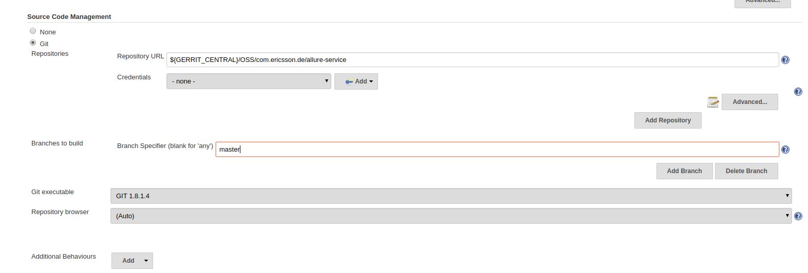
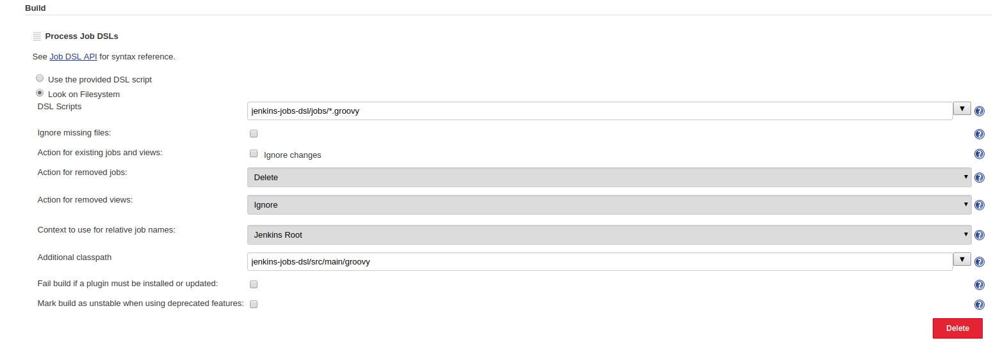

# Prerequisites

## Global Environment Variables
Note: The seed job expects some Global Environment Variables to be present on jenkins

| Name | Value |
| ------------ | ----------------------------------------------- |
| *GERRIT_CENTRAL* | ssh://gerrit.ericsson.se:29418 |
| *GERRIT_MIRROR* | ssh://gerritmirror.lmera.ericsson.se:29418 |

## Seed Job

In order to create all required jobs for "TDM" project
 - Manually create a freestyle job, the name does not matter.
 - Edit the job configuration and scroll down the the "Source Control Management" section and enter the TDM repo details.
 
 - Scroll down to the "Build" section and  add a "Process Job DSLs" build step
 - Select the "Look on Filesystem" option and paste "tdm-deployment-scripts/jenkins/*.groovy" in the "DSL Scripts" textbox.
 - Click on the "Advanced" button and paste "tdm-deployment-scripts/src/main/groovy" in the "Additional classpath" textbox
 
 - Save the configuration and run the job

Once the job runs it automatically creates all the required jobs for the Test Data Management project.

## Jenkins nodes

### Install required `sshpass` library
```bash
yum --enablerepo=epel -y install sshpass
```

# FAQ

## TDM client build fails with 403 HTTP error code or with ECONNRESET error code while NPM package manager tries to fetch resources from its registry
 Make sure maven has the following settings:
 ```xml
   <proxies>
     <proxy>
       <active>true</active>
       <protocol>https</protocol>
       <host>atproxy1.athtem.eei.ericsson.se</host>
       <port>3128</port>
       <nonProxyHosts>*.ericsson.se|localhost</nonProxyHosts>
     </proxy>
     <proxy>
       <id>optional</id>
       <active>true</active>
       <protocol>http</protocol>
       <host>atproxy1.athtem.eei.ericsson.se</host>
       <port>3128</port>
       <nonProxyHosts>*.ericsson.se|localhost</nonProxyHosts>
     </proxy>
   </proxies>
 ```
